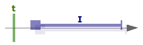

<!---
Copyright © 2022 by Jan Dockx

Licensed under the Apache License, Version 2.0 (the “License”);
you may not use this file except in compliance with the License.
You may obtain a copy of the License at

http://www.apache.org/licenses/LICENSE-2.0

Unless required by applicable law or agreed to in writing, software
distributed under the License is distributed on an “AS IS” BASIS,
WITHOUT WARRANTIES OR CONDITIONS OF ANY KIND, either express or implied.
See the License for the specific language governing permissions and
limitations under the License.
-->

# Allen

Reason and validate the relations between intervals, and points and intervals, in JavaScript and TypeScript. This
library does not help with inference.

When working with intervals, we often want to express constraints (invariants) that limit acceptable combinations.
Expressing this correctly proves difficult in practice. Falling back to working with isolated start and end points, and
reasoning about their relations, in practice proves to be even much more difficult and error-prone. This problem was
tackled in 1983 by James Allen:

- [Allen, James F. “Maintaining knowledge about temporal intervals”], _Communications of the ACM 26(11) pages 832-843;
  November 1983_)

Good synopses of this theory are

- [Wikipedia]
- [Thomas A. Alspaugh “Allen's interval algebra”].

## How to use

### Example

```ts
import { Interval } from './Interval'
import { AllenRelation } from './AllenRelation'
import { PointIntervalRelation } from './PointIntervalRelation'

const iiCondition1: AllenRelation = AllenRelation.fromString<AllenRelation>('pbsSd')
const iiCcondition2: AllenRelation = AllenRelation.fromString<AllenRelation>('sde')
const iiCondition: AllenRelation = iiCondition1.compose(iiCondition2)

const i1: Interval<string> = { start: '2022-11-04', end: '2023-04-12' }
const i2: Interval<string> = { start: '2021-08-22' }

const iiActual: AllenRelation = AllenRelation.relation(i1, i2)
if (!iiActual.implies(iiCondition)) {
  throw new Error(`i1 and i2 do no uphold ${iiCondition.toString()}`)
}

const piCondition1: PointIntervalRelation = PointIntervalRelation.or(
  PointIntervalRelation.BEFORE,
  PointIntervalRelation.TERMINATE
)
const piCondition: PointIntervalRelation = PointIntervalRelation.compose(piCondition1, iiCcondition2)

const p: string = '2021-08-15'
const piActual: PointIntervalRelation = PointIntervalRelation.relation(p, i2)
if (!piActual.implies(piCondition)) {
  throw new Error(`p and i2 do not uphold ${piCondition.toString()}`)
}
```

### Algebra

We find that there are 5 _basic relations_ possible between a definite point and a definite interval:

- `t` is `BEFORE` `I` (`b`)

  

- `t` `COMMENCES` `I` (`c`)

  

- `t` `IN` `I` (`i`)

  

- `t` `TERMINATES`I`(`t`)

  

- `t` is `AFTER` `I` (`a`)

  

and that there are 13 _basic relations_ possible between definite intervals:

- `I1` `PRECEDES` `I2` (`p`)

  

- `I1` `MEETS` `I2` (`m`)

  

- `I1` `OVERLAPS` `I2` (`o`)

  

- `I1` is `FINISHED_BY` `I2` (`F`)

  

- `I1` `CONTAINS` `I2` (`D`)

  

- `I1` `STARTS` `I2` (`s`)

  

- `I1` `EQUALS` `I2` (`e`)

  

- `I1` is `STARTED_BY` `I2` (`S`)

  

- `I1` is `DURING` `I2` (`d`)

  

- `I1` `FINISHES` `I2` (`f`)

  

- `I1` is `OVERLAPPED_BY` `I2` (`O`)

  

- `I1` is `MET_BY` `I2` (`M`)

  

- `I1` is `PRECEDED_BY` `I2` (`P`)

  

These 5, respectively 13, _basic relations_ are an orthogonal basis for all possible _general_ relation-conditions
between a point and an interval (`PointIntervalRelation`), respectively between two intervals (`AllenRelation`).

`(bt)` says that a point can be _before_ an interval, or `terminate` it. `(sde)` says that an interval `i1` may _start_
an interval `i2`, may be _during_ `i2`, or be _equal_ to it. Each general relation expresses a certain amount of
_uncertainty_, where a basic relation expresses certainty, and the `FULL` relation ( `(bcita)`, respectively
`(pmoFDseSdfOMP)`) expresses complete uncertainty.

These 32 (2<sup>5</sup>), respectively 8192 (2<sup>13</sup>), general relations form an algebra, with the operations

- `complement`
- `converse` (only for `AllenRelation`)
- `min`
- `or`
- `and`
- `compose`

A relation to be used as a condition to the problem at hand is build using these operations.

A relation `implies` another relation, or not. E.g., if we have determined that a relation between `i1` and `i2` is
`(oO)`, and we need it to be `(pmoOMP)`, this is ok because `(oO)` `implies` `(pmoOMP)`. If the relation is `(oeO)`
however, it is not ok, because `(pmoOMP)` does not allow the intervals to be `equal`.

Things get even more interesting when we need to reason about _indefinite_ intervals, where the `start` or `end` is
unknown 🤷.

There are some pitfalls.

See [Point – Interval Relation] and [Allen Relation] for details.

### Points and comparison in JavaScript and TypeScript

The only constraint we have on what we use as points, is that we have to be able to compare them with a
[strict total order](https://en.wikipedia.org/wiki/Total¬_order). Technicall we can use anything in JavaScript and
TypeScript to represent points.

For time, we do advise however to only use `string`s (ISO-formatted), `number`s (e.g., as ms since epoch), or `Date`s to
represent points.

See [Points and comparison] for detailed information.

### Intervals

Some common interface is required to work with intervals. This library expects intervals to realize the `Interface<T>`
interface.

See [Intervals] for detailed information.

## Where to find

Repo, CI, issues, pull requests This project is maintained in [Bitbucket] (repo, CI, issues, pull requests, …).

<p style="background-color: lightyellow; color: darkgray;"><strong>TODO</strong> Branches are copied automatically 
to [GitHub] by CI. This is done as backup, and because open source projects are more easily found there. Issues and 
pull requests there will not be reviewed.</p>

### npm

[@toryt/allen][npm]

## Style

[](https://github.com/standard/standard)

This code uses the application to TypeScript[eslint-config-standard-with-typescript] of the [Standard] coding style.
Tests require complete code coverage.

## License

Released under the [Apache License, Version 2.0][license].

<div style="font-style: italic; color: darkslategray;">
<p>Copyright © 2022 by Jan Dockx</p>

<p>Licensed under the Apache License, Version 2.0 (the “License”); you may not use this file except in compliance with
the License. You may obtain a copy of the License at</p>

<p style="margin-left: 1cm;"><a href="http://www.apache.org/licenses/LICENSE-2.0">http://www.apache.org/licenses/LICENSE-2.0</a></p>

<p>Unless required by applicable law or agreed to in writing, software distributed under the License is distributed 
on an “AS IS” BASIS, WITHOUT WARRANTIES OR CONDITIONS OF ANY KIND, either express or implied. See the License for 
the specific language governing permissions and limitations under the License.</p>
</div>

## Notes

This code was based on
[a Java implementation](https://github.com/jandppw/ppwcode-recovered-from-google-code/tree/master/java/value/trunk/src/main/java/org/ppwcode/value_III/time/interval)
last updated in December 2008.

[allen, james f. “maintaining knowledge about temporal intervals”]: https://dl.acm.org/doi/pdf/10.1145/182.358434
[wikipedia]: https://en.wikipedia.org/wiki/Allen%27s_interval_algebra
[thomas a. alspaugh “allen's interval algebra”]: https://www.ics.uci.edu/~alspaugh/cls/shr/allen.html
[strict total order]: https://en.wikipedia.org/wiki/Total¬_order
[points and comparison]: doc/Points.md
[intervals]: doc/Intervals.md
[point – interval relation]: doc/PointIntervalRelation.md
[allen relation]: doc/AllenRelation.md
[bitbucket]: https://bitbucket.org/toryt/allen
[github]: https://github.com/Toryt/allen
[npm]: https://www.npmjs.com/package/@toryt/allen
[standard]: https://standardjs.com
[eslint-config-standard-with-typescript]: https://github.com/standard/eslint-config-standard-with-typescript
[license]: ./LICENSE
