<!---
Copyright © 2022 by Jan Dockx

Licensed under the Apache License, Version 2.0 (the “License”);
you may not use this file except in compliance with the License.
You may obtain a copy of the License at

http://www.apache.org/licenses/LICENSE-2.0

Unless required by applicable law or agreed to in writing, software
distributed under the License is distributed on an “AS IS” BASIS,
WITHOUT WARRANTIES OR CONDITIONS OF ANY KIND, either express or implied.
See the License for the specific language governing permissions and
limitations under the License.
-->

# Allen Relations

When working with intervals, we often want to express constraints (invariants) that limit acceptable combinations.
Expressing this correctly proves difficult in practice. Falling back to working with isolated start and end points, and
reasoning about their relations, in practice proves to be even much more difficult and error-prone.

This problem was tackled in 1983 by James Allen (<a href="https://dl.acm.org/doi/pdf/10.1145/182.358434"><cite>Allen,
James F. &quot;Maintaining knowledge about temporal intervals&quot;; Communications of the ACM 26(11) pages 832-843;
November 1983</cite></a>).

Good synopses of this theory are [Wikipedia](https://en.wikipedia.org/wiki/Allen%27s_interval_algebra), and
<a href="https://www.ics.uci.edu/~alspaugh/cls/shr/allen.html"><cite>Thomas A. Alspaugh &quot;Allen's interval
algebra&quot;</cite></a>, on which the conventions used here are based.

## Quick overview

Allen finds that there are 13 _basic relations_ possible between definite intervals:

- `I1` `PRECEDES` `I2` (`p`)

  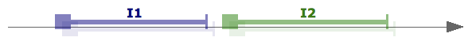

- `I1` `MEETS` `I2` (`m`)

  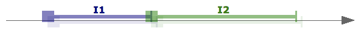

- `I1` `OVERLAPS` `I2` (`o`)

  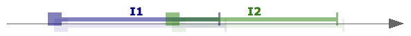

- `I1` is `FINISHED_BY` `I2` (`F`)

  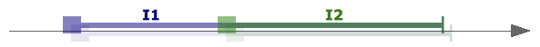

- `I1` `CONTAINS` `I2` (`D`)

  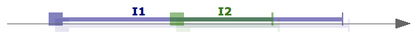

- `I1` `STARTS` `I2` (`s`)

  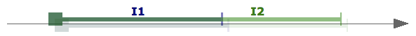

- `I1` `EQUALS` `I2` (`e`)

  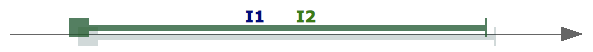

- `I1` is `STARTED_BY` `I2` (`S`)

  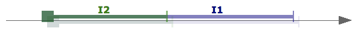

- `I1` is `DURING` `I2` (`d`)

  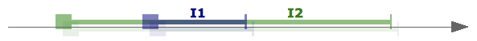

- `I1` `FINISHES` `I2` (`f`)

  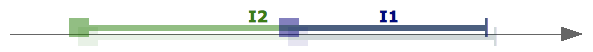

- `I1` is `OVERLAPPED_BY` `I2` (`O`)

  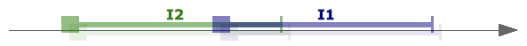

- `I1` is `MET_BY` `I2` (`M`)

  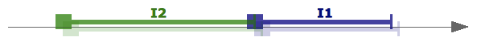

- `I1` is `PRECEDED_BY` `I2` (`P`)

  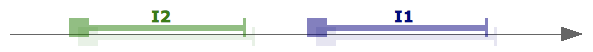

These basic relations can be compared to the relations `<`, `=`, and `>` between 2 points.

When reasoning about the relationship between intervals however, like when comparing points, we also often employ
_indeterminate_ relations, such as `I1 (pm) I2` (`I1` `PRECEDES` `I2`, or `MEETS` `I2`). This is comparable to reasoning
with `≤`, `≥`, and `≠` with points.

For intervals, given 13 basic relations, we get 8192 (= 213) possible _general relations_. This includes the
`FULL` relation (comparable to `< ⋁ = ⋁ >` with points), which expresses the maximum uncertainty about the relation
between two intervals. `FULL` means you are from Barcelona. The `EMPTY` relation is not a true relation. It does not
express a relational condition between two intervals. It is needed for consistency with some algebraic operations on
relations.

## Interval constraints

<strong>MUDO: port remaining text</strong>

## Reasoning with unknown but constrained start and end point

<strong>MUDO: port remaining text</strong>

## Inference

**Be aware that, in general, inference over intervals, also using Allen relations, is NP-complete.** This means that the
time the execution of inference algorithms will take, is at least difficult to ascertain, and quickly completely
impractical (i.e., with realistic parameters the algorithm would take longer than the universe exists — no kidding).

There are subsets of the Allen relations for which there exist algorithms that perform much better.

This library does not offer inference functions at this time. The main intention of this library is validation.
