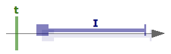
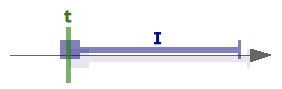
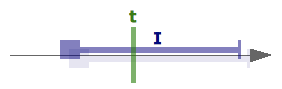
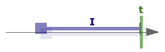
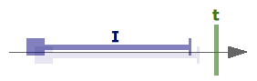

# Point – Interval Relation

When working with points and intervals, we often want to express constraints (invariants) that limit acceptable
combinations. Expressing this correctly proves difficult in practice. Falling back to working with isolated start and
end points, and reasoning about their relations with the point, in practice proves to be even much more difficult and
error-prone.

Support for reasoning about point – interval relations is developed following the example of Allen interval – interval
relations.

## Quick overview

We find that there are 5 _basic relations_ possible between a point and a definite interval:

- `t` is `BEFORE` `I` (`b`)

  

- `t` `COMMENCES` `I` (`c`)

  

- `t` `IN` `I` (`i`)

  

- `t` `TERMINATES`I`(`t`)

  

- `t` is `AFTER` `I` (`a`)

  

These basic relations between a point and an interval are similar to `<`, `=`, and `>` between 2 points.

When reasoning about the relationship between points and intervals however, like when comparing time instances, we also
often employ _indeterminate_ relations, such as `t (bc) I` (`t` is `BEFORE` `I`, or `COMMENCES` `I`). This is comparable
to reasoning with `≤`, `≥`, and `≠` with time instances.

For points and intervals, given 5 basic relations, we get 32 (= 2<sup>5</sup>) possible _general relations_. This
includes the `FULL` relation (comparable to `< ⋁ = ⋁ >` with points), which expresses the maximum uncertainty about the
relation between a point and an interval. `FULL` means you are from Barcelona. The `EMPTY` relation is not a true point
– interval relation. It does not express a relational condition between a point and an intervals. It is needed for
consistency with some algebraic operations on point – interval relations.

## Interval constraints

Point – interval relations will most often be used in business code to _constrain_ relations between points and
intervals. This is notoriously, treacherously difficult. It is for this reason that you should use code like this, that
at least forces you to think things trough, and tries to offer tools to ease reasoning. The idiom to do this is
explained next.

First we need to determine the relation we want to uphold (`condition`). E.g., we want to assert that given a point in
time `t` does not fall before a time interval `I` is ‘fully started’. The relationship that expresses this is

```
condition = (bc)
```

Next, we want to determine the relationship between `t` and `I` as precisely as possible. If `I` is completely
determined, i.e., neither its `start` nor its `end` is `undefined`, the result will be a _basic relation_ (i.e.,
`(b)`,`(c)`, `(i)`, `(t)`, or `(a)`). Otherwise, the result will be a less certain relation. To determine this
relationship, use `relation<T> (t: T | undefined, i: Interval<T>, compareFn?: Comparator<T>): PointIntervalRelation`.

The idiom for the assertion we want to express is then:

```ts
relation(t, I).implies(condition)
```

Note that this can fail, on the one hand because the actual relation violates the `condition`, but also because _we
cannot be 100% sure that the actual relationship satisfies the `condition`_.

In our example, we would have:

```ts
relation(t, I).implies(or(BEFORE, COMMENCES))
```

If the actual relation results in `IN` (`(i)`), for example, the constraint is clearly not satisfied. If the actual
relation results in `(bi)`, it means that it is possible that the relation is satisfied, but there is also a chance that
it is not.

In code then, we often want to throw an exception to interrupt an algorithm that would violate the `condition`. The
idiom for this is usually of the form:

```ts
...
T t = ...;
Interval<T> i = ...;
PointIntervalRelation condition = ...;
PointIntervalRelation actual = relation(t, i);
if (!actual.implies(condition)) {
  throw new ....
}
...
```

In our example, this would become

```ts
...
Date t = ...;
TimeInterval<Date> i = ...;
if (!relation(t, i).implies(or(BEFORE, COMMENCES)) {
  throw new ....
}
...
```

**Note that in general `!actual.implies(condition)` is _not equivalent_ to `actual.implies(condition.complement())`.**

In our example this is already clear. If the actual relation results in `(i)`, both expressions evaluate to `true`:

```
  relation(t, I) ⊈ (bc)
⇔ (i) ⊈ (bc)
⇔ true

  relation(t, I) ⊆ (bc).complement
⇔ (i) ⊆ (bc).complement)
⇔ (i) ⊆ (ita)
⇔ true
```

But in the case where the actual relation results in `(bi)`, they do not:

```
  relation(t, I) ⊈ (bc)
⇔ (bi) ⊈ (bc)
⇔ true

  relation(t, I) ⊆ (bc).complement
⇔ (bi) ⊆ (bc).complement
⇔ (bi) ⊆ (ita)
⇔ false
```

`relation(t, I) ⊈ (bc)` (`!relation(t, i).implies(or(BEFORE, COMMENCES))`) expresses that [we want to throw an exception
if] _it is not guaranteed that `t` is before `i` is fully started_. `relation(t, I) ⊆ (bc).complement`
(`relation(t, i).implies(or(BEFORE, COMMENCES).complement())`) expresses that [we want to throw an exception if] _it is
guaranteed that `t` is after `i` is fully started_. **These 2 phrases are not equivalent.**

Consider an `undefined` start for `I`. When `t` is before the `end` of `I`, we cannot know whether `t` is before, equal
to, or after the `start` of `I`.

```
relation(t, I) = (bci)
```

With `relation(t, I) ⊈ (bc)` we would throw an exception. `t` could be `BEFORE` `I`, or commence `I`, which would be ok,
but `t` could also be `IN` `I`, which is not ok. It is not guaranteed that `t` is before `I` is fully started, so
`relation(t, I) ⊆ (bc)` is `false`, and `relation(t, I) ⊈ (bc)` is `true`.

With `relation(t, I) ⊆ (bc).complement` we would not throw an exception. `t` could be `IN` `I`, which would not be ok,
but it could also be `BEFORE` `I`, or commence `I`, and so it is _not guaranteed_ that `t` is after `I` is fully
started. `relation(t, I) ⊆ (bc).complement` is `false`.

## Reasoning with unknown but constrained start and end point

In intervals, the start or end can be `undefined`. The semantics of this is in general that the `start`, respectively
the `end`, is unknown 🤷. Comparing such an interval with a point results in a relatively broad point – interval
relation, expressing an amount of uncertainty.

In several use cases however, we do not know a _definite_ `start` or `end`, but we do know that the `start` or `end`
have constraints. E.g., consider contracts that have a definite `start` date, but are open-ended. The contract interval
thus is incompletely known. However, since at the moment of our reasoning no definite `end` date is set, we know that
the `end` date is at least not before `now`. In comparing this contract interval with a point in time, this constraint
can be of use to limit the extent, i.e., the uncertainty, of the point – interval relation. The same applies, e.g., with
contracts that will `start` once payment is received. Since it is not received yet at the moment of our evaluation, we
know that the `start` date is at least later than or equal to `now`.

In such cases, the interval object `I` we are focusing on can be interpreted in another way. Suppose we are comparing
`I` with a point in time `t`. We are actually not interested in `relation(t, I)`, but rather in <code>relation(t,
I<sub>constrained</sub>)</code>. Sadly, there is no easy syntax (or code) to express
<code>I<sub>constrained</sub></code>. What we can express is an <code>I<sub>determinate</sub></code>, where _the border
times are filled out in place of the unknown `start` or `end`_. <code>relation(t, I<sub>determinate</sub>)</code> can be
calculated, and will be much less uncertain than `relation(t, I)`. If we now can determine the Allen relation from
<code>I<sub>determinate</sub></code> to <code>I<sub>constrained</sub></code>, we can find <code>relation(t,
I<sub>constrained</sub>)</code> as:

```
relation(t, IConstrained) =
  compose(relation(t, IDeterminate), allenRelation(IDeterminate, IConstrained))
```

The Allen relation from an interval we are focusing on with constrained semantics to a determinate interval is a
constant that can be determined by reasoning. E.g., for our open-ended contract, that lasts at least longer than before
today (<code>I<sub>constrained</sub> = [I.start, ≥ now[</code>, supposing`I.start ≤ yesterday`), we can say that its
relation to the determinate interval <code>I<sub>determinate</sub> = [I.start, now[</code> is `(se)`. Suppose
<code>relation(t, I<sub>determinate</sub>)</code> is `(i)` (say`t`is`yesterday`). We can now say that <code>relation(t,
I<sub>constrained</sub>) = (i).(se) = (i)</code>. The comparison of the indeterminate interval with `t`,
`relation(t, I)`, would have resulted in:

```
  relation(t, I)
= relation(yesterday, [I.start, undefined[)
= (ita)
```

which is much less certain than `(i)`.

Be aware that in a number of cases, the non-determinate character of `I` doesn't matter. If you suppose in the previous
example that <code>relation(t, I<sub>constrained</sub>) = (a)</code> (say `t` is next year), <code>relation(t,
I<sub>constrained</sub>) = (se).(a) = (ita)</code>. The comparison of the indeterminate interval with `t`,
`relation(t, I)`, in this case, results in the same point-interval relation:

```
  relation(t, I)
= relation(nextYear, [I.start, undefined[)
= (ita)
```

For `t = now`, we get <code>relation(t, I<sub>determinate</sub>) = (t)</code>, so <code>relation(t,
I<sub>constrained</sub>) = (t).(se) = (it)</code>, which is still less uncertain than `(ita)`.
