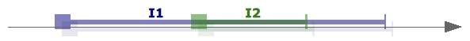
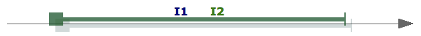
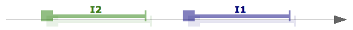

<!---
Copyright © 2022 by Jan Dockx

Licensed under the Apache License, Version 2.0 (the “License”);
you may not use this file except in compliance with the License.
You may obtain a copy of the License at

http://www.apache.org/licenses/LICENSE-2.0

Unless required by applicable law or agreed to in writing, software
distributed under the License is distributed on an “AS IS” BASIS,
WITHOUT WARRANTIES OR CONDITIONS OF ANY KIND, either express or implied.
See the License for the specific language governing permissions and
limitations under the License.
-->

# Points as intervals

“Points”, including the `start` and `end` of intervals, are never realy points. Due to Heisenberg's uncertainty
principle, we know that we fundamentally cannot be more precise, e.g., for time, than the
[Planck duration](https://en.wikipedia.org/wiki/Planck_units#Planck_time) (~ 5.39.10<sup>−44</sup> s). In practice, any
measurement, any clock, has a limited precision. The “points” we are using are actually also intervals. E.g., given an
interval with ms precision:

```ts
const i = {
  start: '2022-10-29T16:03:53.263Z',
  end: '2022-10-29T16:04:20.870Z'
}
```

`start` actually represents the interval `is = [2022-10-29T16:03:53.263Z, 2022-10-29T16:03:53.264Z[`, and `end` actually
represents the interval `ie = [2022-10-29T16:04:20.870Z, 2022-10-29T16:04:20.871Z[`. The interval `i` starts somewhere
in `is`, and ends somewhere in `ie`.

With this reasoning, when we compare isolated “points” `p1` and `p2`, we are actually comparing definite intervals,
_represented by a point_, too. The Allen relation between the point representations will be a basic relation, because
`p1` and `p2` are _definite_ intervals. When we limit ourselves to point representations with a defined precision, the
same for `p1` and `p2`, we know both point-intervals have the same length or duration, and a shorter length is
impossible. This limits the possibilities further.

| `p1 (.) p2` | Illustration                                        | Definition (mentioned properties must be definite, and …)   | Point relation |
| ----------- | --------------------------------------------------- | ----------------------------------------------------------- | -------------- |
| `p1 (p) p2` |              | `p1.end < p2.start`                                         | `p1 < p2`      |
| `p1 (m) p2` |                    | `p1.end = p2.start`                                         | `p1 < p2`      |
| `p1 (o) p2` |              | `p1.start < p2.start ∧ p2.start < p1.end ∧ p1.end < p2.end` | ❌ 3.          |
| `p1 (F) p2` |      | `p1.start < p2.start ∧ p1.end = p2.end`                     | ❌ 1. 2.       |
| `p1 (D) p2` |              | `p1.start < p2.start ∧ p2.end < p1.end`                     | ❌ 2.          |
| `p1 (s) p2` |                  | `p1.start = p2.start ∧ p1.end < p2.end`                     | ❌ 1.          |
| `p1 (e) p2` |                  | `p1.start = p2.start ∧ p1.end = p2.end`                     | `p1 = p2`      |
| `p1 (S) p2` |        | `p2.start = p1.start ∧ p2.end < p1.end`                     | ❌ 1.          |
| `p1 (d) p2` |                  | `p2.start < p1.start ∧ p1.end < p2.end`                     | ❌ 2.          |
| `p1 (f) p2` |              | `p2.start < p1.start ∧ p1.end = p2.end`                     | ❌ 1. 2.       |
| `p1 (O) p2` |  | `p2.start < p1.start ∧ p1.start < p2.end ∧ p2.end < p1.end` | ❌ 3.          |
| `p1 (M) p2` |                | `p2.end = p1.start`                                         | `p2 < p1`      |
| `p1 (P) p2` |      | `p2.end < p1.start`                                         | `p2 < p1`      |

1. When either `start` or `end` of `p1` and `p2` should be equal according to the definition (`(F)`, `(s)`, `(e)`,
   ` (S)`, `(f)`), the other end will be equal too, since `p1` and `p2` as intervals have equal length. This is only
   satisfied by `(e)`.

2. If either `start` or `end` of `p1` and `p2` should not be equal according to the definition, but either relate as `<`
   or `>` (`(p)`, `(o)`, `(F)`, `(D)`, `(s)`, `(S)`, `(d)`, `(f)`, `(O)`, `(P)`), the other ends will have the same
   relation, since `p1` and `p2` as intervals have equal length. `(o)` and `(O)` satisfy this condition. `(p)` and `(P)`
   avoid the condition by not expressing the relation of the other end. The definitions of `(F)`, `(D)`, `(s)`, `(S)`,
   `(d)`, or `(f)`, cannot be satisfied for intervals of equal lenght.

3. If `p1.start < p2.start`, `p1.end = p1.start + pl ≤ p2.start`, since `p1` has the smallest possible length `pl > 0`.
   Adding the smallest possible length to `p1.start` can at most make it equal to `p2.start`, but can cannot make it
   larger. If `p2.start < p1. start`, `p2.end = p2.start + pl ≤ p1. start`, since `p2` has the smallest possible length
   `pl > 0`. Adding the smallest possible length to `p2.start` can at most make it equal to `p1.start`, but can cannot
   make it larger. (`(p)`, `(o)`, `(F)`, `(D)`, `(s)`, `(S)`, `(d)`, `(f)`, `(O)`, `(P)`) have this relation between
   their starting points. (`(p)`, `(F)`, `(D)`, `(s)`, `(S)`, `(d)`, `(f)`, `(P)`) avoid the condition by not expressing
   the cross relation with the `end` of the other point. The definitions of `(o)` and `(O)` cannot be satisfied for
   intervals of minimum length.

### Equal point reprsentations (=)

When we interpret the point representation `rp` as the interval `i` such that `p ∈ i`, two equal point representations
`rp1 = rp2` do not necessarily represent the same interval. `rp1 = rp2`, with `rp1` representing `i1` and `rp2`
representing `i2`, then means

```
  (rp1 ∈ i1) ∧ (rp2 ∈ i2) ∧ (|i1| = pl) ∧ (|i2| = pl) ∧ (rp1 = rp2)
⇔ (rp1 = rp2 ∈ i1) ∧ (rp1 = rp2 ∈ i2)
⇔ (rp1 = rp2 ∈ i1 ∩ i2)
⇔ (i1 ∩ i2 ≠ ∅)
```

The relationship where 2 half-open intervals have at least 1 common point is `i1 (oFDseSdfO) i2`. Since `(F)`, `(D)`,
`(s)`, `(S)`, `(d)`, and `(f)`, and `(o)` and `(O)` cannot be satisfied with point-intervals, only `i1 (e) i2` remains.

### Unequal point representations (<, >)

When a point representation is smaller than the other, e.g., `rp1 < rp2`, with `rp1` representing `i1` and `rp2`
representing `i2`, this means the smallest possible element of `i1` must be smaller than the largest possible element of
`i2`. When we are working with right half-open intervals, with a fixed minimum length `pl`, this means:

```
  (rp1 ∈ i1) ∧ (rp2 ∈ i2) ∧ (|i1| = pl) ∧ (|i2| = pl) ∧ (rp1 < rp2)
⇔ (rp1 ∈ [i1.start, i1.start + pl[) ∧ (rp2 ∈ [i2.start, i2.start + pl[) ∧ (rp1 < rp2)  [A]
⇔ i1.start < i2.start + pl = i2.end
```

The relationship where `i1.start < i2.end` is possible is `i1 (pmoFDseSdfO) i2`. Barring definitions that cannot be
satisfied for point-intervals, this results in `i1 (pme) i2`. The symmetric case, for `rp2 < rp1`, results in
`i1 (eMP) i2`. `(e)` turns up here because the intervals `i1` and `i2` are not precisely known, and only knowing
`i1. start < i2.end` does not bar interval equality. For that `p1.start = p2.start ∧ p1.end = p2.end` has to be false in
all cases. If this was true, with `p1.start = p2.start = pstart` and `p1.end = p2.end = pstart + pl` (reductio ad
absurdum):

```
  [A]
⇔ (rp1 ∈ [pstart, pstart + pl[) ∧ (rp2 ∈ [pstart, pstart + pl[)
⇔ |rp1 - rp2| < pl
```

The point representations `rp1` and `rp2` have to be less than `pl` apart. That is impossible, since `pl` is the
smallest precision that can be expressed in the point representations. Finally, the resulting relations are
`i1 (pm) i2`, and `i1 (MP) i2` for the symmetric case.

### Indefinite points

When a point representation is indefinite, we do not know what interval it represents, but we do know that it represents
an interval of fixed minimal length `pl`. This means the above rules apply, and that the comparison of an indefinite
point representation with another, definite or indefinite point representation, must be `(pm)`, `(e)`, or `(MP)`. Since
we do not know where on the number line this interval is located, we cannot limit the relation more, and the result is
`(pmeMP)`.
